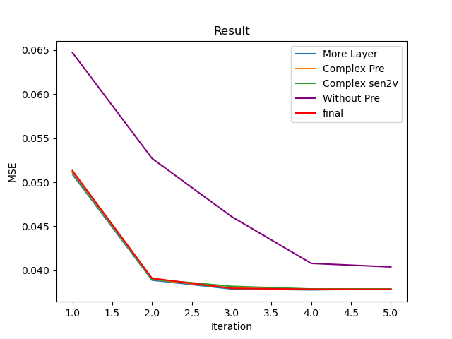

# Assessing Humor in Edited News Headlines with LSTM
## Introduction
We have seen a lot of research on analyzing whether a sentence is humor, but sometimes we're more curious on how the humor is created. There's a magic of humor that we can only change a word in a sentence to make a unintersting sentence humorous. 
For example, the original sentence
```
' A lot of work to be done ' : Senator discusses tax reform after Trump hosts bipartisan dinner
```
is an ordinary serious newspaper headline. However, we just need to change the word ```hosts``` to ```microwaves```, we can make the sentence interesting.

The trick is often used in somewhere needs to attract intention but the modification shouldn't change the meaning of the sentence. 

The problem is also worth researching. Unlike traditional problems like assessing the humor of a sentence, we are curious about how the edit action will influence the humor of the sentence. It means we should learn how a change can influence the overall humor. 

## Training and Testing Data
Luckily, the academy is interested in the topic, and we have a online competition with exact the topic. There's a very clean and nice dataset provided on the online competition. The dataset is a set of newspaper headlines, including the edit action, and a score in $[0,3]$. For example, the example we used previously in the training set is 
```
' A lot of work to be done ' : Senator discusses tax reform after Trump 
    <hosts/> bipartisan dinner, microwaves, 2.4
```
We do a series of pre-processing on the dataset.
- Create a new column with the edited word replaced
- Remove all symbols and numbers in sentences
- Turn all letter into lowercase
- Remove nltk stopwords
- Remove words with 10% lowest frequency in whole training set and test set
- Lemmatization or recover all words to original form. For example we turn "tested" and "testing" into "test"
- Tokenize both the original sentence and the replaced sentence
Our experiments show that the pre-processing is very important in solving the problem, so please don't forget to do them. 

## Methods
### Word to Vector
In natural language processing, we can't directly work on words. It's natural to map a word to some vector with some restriction. Most importantly, we want similar words to have a closer cosine distance for their vector. Word2vec is a technique applied to achieve the aim.
Training a word2vec model cost a lost of time typically, hence we directly use a welcomed pre-trained word2vec model posted by google. You can refer to the page \url{https://code.google.com/archive/p/word2vec/} for more information.
### Network Build-up
We find in our experiment that the network configurations will not contribute to the performance very obviously under our design. Hence we introduce the simplest design with a good performance. 
We use "kersa" library in this project. Kersa is a AI library packed on the level of layers, which means even more higher then Tensorflow (tensor level). You should install kersa and tensorflow backend.
The design contains an embedding layer, a bidirectional LSTM layer and a dense layer. 
- Frankly speaking, we don't really need an embedding layer. We add it because we encounter some tough errors without it. You can just follow the common (or even default) settings.
- The bi-LSTM layer is the main layer we learn something. LSTM is very popular in NLP, hence we assume you have some knowledge of it. You can play with the configures yourself, but we don't recommend that because you may find the performance is similar. 
- The last dense layer additionally serve as a scale map to range $[0,1]$. Note that our range was initially $[0,3]$, so just multiple 3 to get the range.

Here's a cut of our code for your reference.
```
bi_lstm.add(keras.layers.Bidirectional(keras.layers.LSTM    (
    units=input_len, activation="tanh", 
    use_bias=True, dropout=0.15, recurrent_dropout=0.1)))
bi_lstm.add(keras.layers.Dense(units=1, activation="sigmoid"))
bi_lstm.compile(loss='mse', optimizer='sgd', metrics=['accuracy', 'mse'])
history_bi_lstm = bi_lstm.fit(X_train, Y_train, 
    batch_size=32, epochs=5, validation_data=(X_test, Y_test))
```

### Result and Discussion
You can find our code, report and intermediate pickle records in the repo \url{https://github.com/sweetsinpackets/SI630-Project}.
The bad news is that the performance for our model is not quite good. Though it beats some simple baselines, but the performance is still far from applying to use.
We think the reason might that we don't actually learn important knowledge because our design can't encode the edit action. Frankly speaking, we learn mostly from the edited sentence, so we drop the information from the original.

Another strange thing is that the performance of different attempts in configuration leads to similar performance. 
 
We review this a proof for that we didn't learn much things, because the result seems mostly like over-fitting.

### What's next?
Though our model didn't give a good result, the topic is still valuable to research. If you want to try it based on our effort or explore by your own, here are some suggestions you might try.
- Find a way to encode the edit action into a trainable vector
- Try multiple LSTM layers
- Use a balanced dataset with enough samples with high humor score.